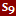

title: Formatting Markdown


%%%%%%%%%%%%%%%%%%%  
% Headers

## Headers

Header 1:

# Header 1

or

Header 1
========

Header 2:

## Header 2

or

Header 2
--------

Header 3:

### Header 3

Header 4:

#### Header 4

Header 5:

##### Header 5

Header 6:

###### Header 6


Note: Closing hashes (###) are optional and do NOT need to match e.g.

Header 6:

###### Header 6 ####


%%%%%%%%%%%%%%%%%%%%%%%%%%%%%%%%%%%%%%%%%%%%%%%  
% Text Formatting (Bold, Italic, Monospace)

## Text Formatting - Bold, Italic, Monospace

bold text:

**bold text**

or

__bold text__

italic text:

*italic text*

or

_italic text_

bold and italic text:

***bold and italic text***

or

___bold and italic text___

monospace text:

`monospace text`


%%%%%%%%%%%%%%%%%%%%%%%%%%%%%%%%   
% Lists - Bulleted, Numbered

## Lists

Bulleted (unordered) list:

* Start each line
* with an asterisk (*), plus (+), or hyphen (-).
    * Indent by four spaces gives deeper
        * and deeper levels.
* Another point
* And another


Numbered (ordered) list:

1. Start each line
2. with a number followed by by period (.).
    1. Indent by four spaces gives deeper
        1. and deeper levels.
3. Another point
4. And another


Note: Do NOT use more asterisks for deeper levels e.g. ** level two, *** level three etc.

%%%%%%%%%%%%%%%%%%%%%%%%%%%%%%%%%%  
% Links

## Links

Links:

Here's an inline link to [Google](http://www.google.com).
Here's a reference-style link to [Google][1].
Here's a readable link to [Google][google].

[1]: http://www.google.com
[google]: http://www.google.com


%%%%%%%%%%%%%%%%%%%%%%%%%%%%%%%%%%%%  
% Images

## Images

Here's an inline link to .
Here's a reference-style link ![][2].
Here's a readable link ![][s9logo].

[2]: i/s9logo.png
[s9logo]: i/s9logo.png


%%%%%%%%%%%%%%%%%%%%%%%%%%%%%%%%%%%%%%  
% Code Blocks

## Code Blocks

    class Greeter
      def initialize(name)
        @name = name.capitalize
      end
    
      def salute
        puts "Hello #{@name}!"
      end
    end
    
    g = Greeter.new("world")   # Create a new object
    g.salute                   # Output "Hello World!"

or

```
class Greeter
  def initialize(name)
    @name = name.capitalize
  end

  def salute
    puts "Hello #{@name}!"
  end
end

g = Greeter.new("world")   # Create a new object
g.salute                   # Output "Hello World!"
```


%%%%%%%%%%%%%%%%%%%%%%%%%%%%%%%%%%%%  
% Tables

## Tables


%%%%%%%%%%%%%%%%%%%%%%%%%%%%%%%%%%%%  
% Horizontal Rules

## Horizontal Rules

---

or

*******

or
___


or

- - - - -

Note: Three or more or more hyphens (-), asterisks (*), or underscores (_) on a line by themselves;
using spaces between the characters works too.


%%%%%%%%%%%%%%%%%%%%%%%%%%%%%%%%%%%%%  
% Escape Markdown Markup

## Escape Markdown Markup

<div>
**bold text**
*italic text*

* a simple bulleted list
* another point
* another point
</div>

Note: Use `<div markdown=1>` to enable Markdown conversion in div blocks.


%%% todo/check: markdown processed inside an inline block eg. span??


%%%%%%%%%%%%%%%%%%%%%%%%%%%%%%%%%%  
% Tips / Advanced

## Tips

Forced line breaks- Add two spaces at end of each line to force line breaks:

O Romeo, Romeo! wherefore art thou Romeo?   
Deny thy father and refuse thy name;  
Or, if thou wilt not, be but sworn my love,  
And I'll no longer be a Capulet.


Headers must start with a blank line and end with a blank line:

### Header 3

Do NOT use

some text
### Header 3
some more text


Nested lists must indent by at least four spaces:

* Level one
  * Level two (two spaces / indent by up-to 4 spaces)
    * Level two too (four spaces / indent by up-to 4 spaces)
     * Level three  (five spaces / indent by more than 4 spaces)
        * Level three again (eight spaces / indent by more than 4 spaces)
         * Level four (nine spaces / indent by more than 4+4 spaces)
